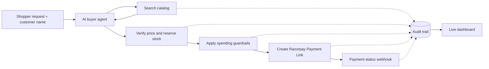

# Agentic Catalog — Studio Loom

Studio Loom is an agent-ready fashion storefront built for the Razorpay Buildathon. A shopper describes what they want in plain language; an AI buyer agent searches the catalog, selects a matching item, and creates a Razorpay test-mode Payment Link. Every decision is visible in an audit trail.

## Why it matters

Agentic commerce needs more than a product search. This project makes the purchase path safe and explainable:

- Agent-readable catalog responses with product, price, stock, and seller details.
- Atomic stock reservation so concurrent requests cannot oversell the last item.
- Configurable spending limits and approval gates before a payment link is issued.
- Razorpay Payment Links with timeout, retry, webhook handling, and stock release on failure.
- A dashboard that shows the selected item, checkout outcome, and a chronological audit trail.

## How it works

The buyer agent uses the same public HTTP endpoints available to any external client; it does not access the database directly. The dashboard requires a customer name and forwards it all the way to Razorpay when a payment link is created.

## Stack

- **Frontend:** React, TypeScript, Vite, Tailwind CSS
- **Backend:** Express, TypeScript, Mongoose, MongoDB
- **AI:** Gemini for intent extraction and product selection
- **Payments:** Razorpay Test Mode Payment Links and webhooks

## Run locally

1. Install dependencies: `npm install`
2. Copy `.env.example` to `server/.env` and configure:
   - `MONGODB_URI`
   - `RAZORPAY_KEY_ID` and `RAZORPAY_KEY_SECRET`
   - `LLM_API_KEY`
3. Copy `VITE_API_BASE_URL=http://localhost:5000/api` into `client/.env`.
4. Seed the catalog: `npm run seed`
5. Start the app: `npm run dev`
6. Open `http://localhost:5173`, enter a product request and customer name, then select **Run**.

For payment-status updates, expose the server with `ngrok http 5000`, register `https://<your-url>/api/webhooks/razorpay` in Razorpay Dashboard, and set `RAZORPAY_WEBHOOK_SECRET` in `server/.env`.

## API

| Method | Path | Purpose |
| --- | --- | --- |
| `GET` | `/api/health` | Health check |
| `GET` | `/api/catalog` | List products |
| `GET` | `/api/catalog/search?q=&maxPrice=&category=` | Search products |
| `PATCH` | `/api/catalog/:id` | Update a catalog item |
| `POST` | `/api/checkout/:productId` | Verify, gate, and create a payment link |
| `POST` | `/api/agent/buy` | Run the AI buyer agent with `want` and `customerName` |
| `GET` | `/api/audit?orderId=` | View an order's audit trail |
| `POST` | `/api/webhooks/razorpay` | Receive Razorpay payment updates |

## Scripts

| Command | Purpose |
| --- | --- |
| `npm run dev` | Run frontend and backend together |
| `npm run build` | Build both workspaces |
| `npm run seed` | Seed the catalog |
| `npm run agent -- "<want>"` | Run the buyer agent from the terminal |
| `npm run agent` | Start the interactive terminal buyer agent |
| `cd server && npm run test:race -- <productId> <n>` | Test concurrent stock reservation |

## Demo and technical notes

- [Architecture](docs/architecture.md) — request flow and design decisions.
- [Failure handling](docs/failure-scenarios.md) — stock and payment failure behaviour.
- [Audit schema](docs/audit-schema.md) — audit events and fields.

## Current limitations

- Catalog administration has no authentication and is intended for local demos.
- Orders awaiting approval do not yet have an approve/deny endpoint.
- The dashboard displays the completed agent run rather than streaming each intermediate step.
